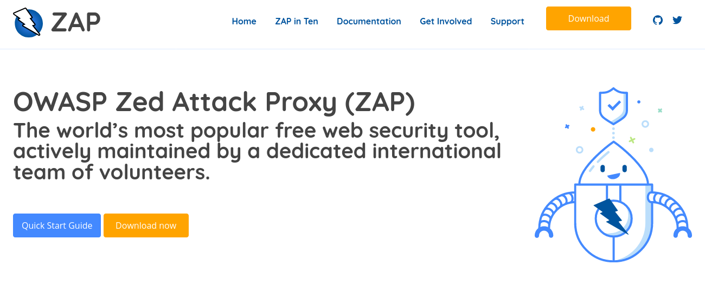

---

layout: col-sidebar
title: OWASP ZAP
site_side: true
tags: zap
project: true
level: 4
type: tool
pitch: The OWASP Zed Attack Proxy (ZAP) is one of the world’s most popular free security tools and is actively maintained by a dedicated international team of volunteers. Great for pentesters, devs, QA, and CI/CD integration. 
---

For more details about ZAP see the main ZAP website at [zaproxy.org](https://www.zaproxy.org) and for ZAPCon visit [zapcon.io](https://zapcon.io)


